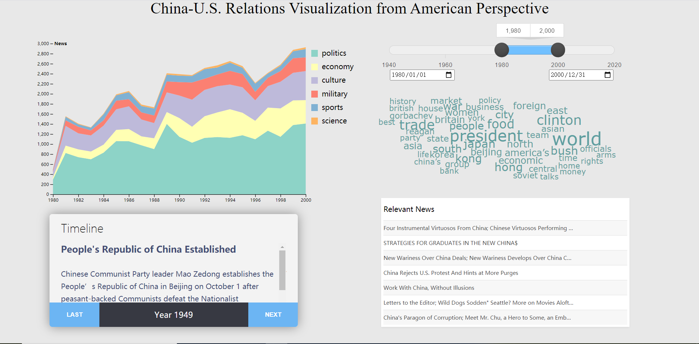

## China-US Relationship Visualization

**Introduction to Visualization and Visual Computing, 2021, Final Project**

### Demo

### Project Description

#### Motivation

How can we visualize the China-US relationship in the past 100 years?

- There is no ready-made given data

- historical events have only a few words to visualize

- economic transaction data can only reflect a perspective of China-US relations.

Newspapers! Rich data, reflecting China-US relations from the side.

#### Data Collection

- A total of 9 newspapers at home and abroad

- Search for "China America" and crawl all (titles, abstracts, events, links).

- Each newspaper is individually crawled and sorted.

Copyright: we apply to the New York Times for early years data.

#### Modules

1. Having a grasp of the overall development of China-US relations
   - Time wheel
   - Date module
   - Stacked Area Chart
2. For a certain period of time
   - Key information from Word Cloud
   - Historical background from Major Events
3. Articles on a topic in a certain period of time
   - Select multiple keywords, and articles with more keywords appear on the right
   - Click the link to go directly
   - Example: 2010-2020 Keywords: "trump" "obama". The message appears: "Obama and Xi avoid Cold War"

### Challenges

Data volume: about 30w pieces of data, each with >10 words

Each time the time changes, the results of multiple modules are recalculated

Every time you drag the time bar, multiple event time changes will be triggered (about 5 times)

Without more processing, the amount of data to be processed per drag is as high as 3000W

Solution: hierarchical sampling

### Bug Fixing

1. It is recommended to use 1080p resolution and 150% zoom to open
2. The default data (data/merged.csv) is the data after the first round of sampling; see alldata/merged.csv for complete data
3. If you open the web page and get messy pictures (especially when you're outside China mainland), this may be due to the fact that we are using data sources in China. Please contact us if you encounter this situation.

### Teamwork

Yuheng Wu, Yunzhe Liu, Pu Yi, Haoxiang Yang

For full data, preprocessing codes and any questions, contact Haoxiang at yanghaoxiang7@gmail.com.

